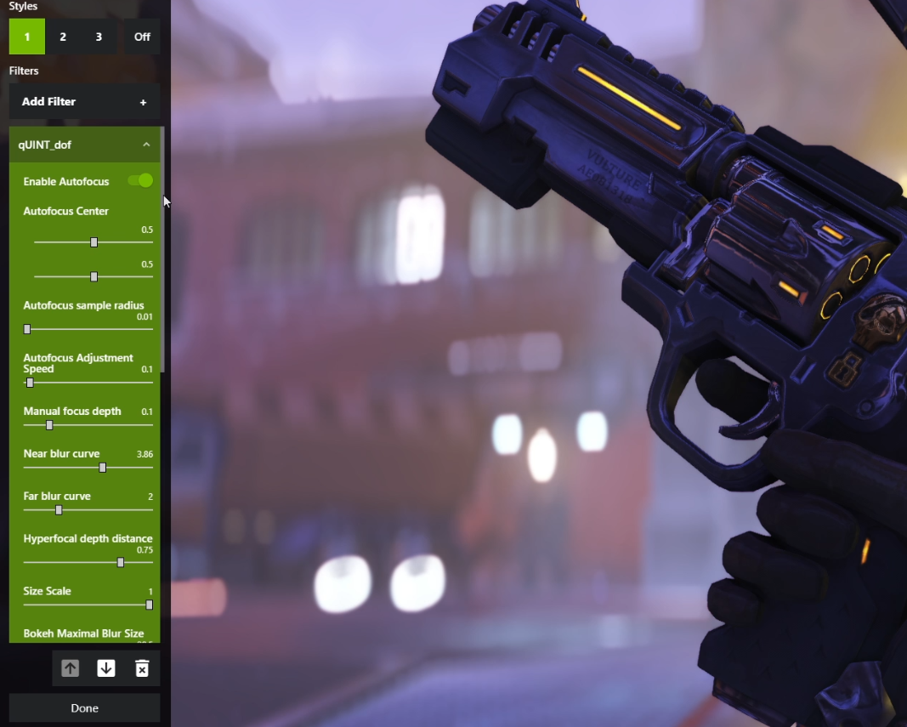
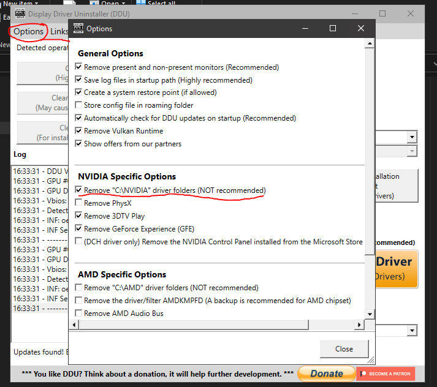
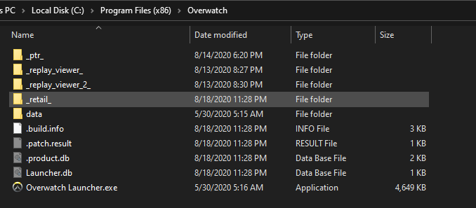
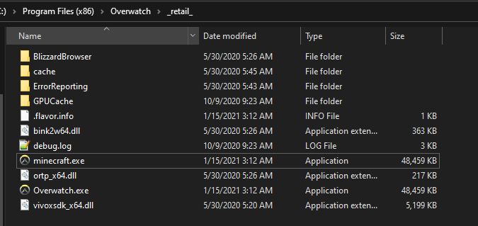
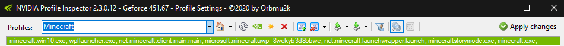
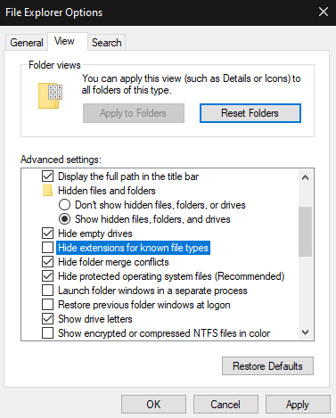
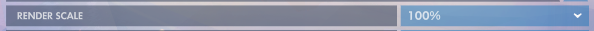

# Overwatch-Freestyle 

A guide outlining the process of using Nvidia Freestyle in Overwatch

Disclaimer: use this at your own risk! I am not liable for any bans/suspensions resulting in you using this guide.
<!-- TOC -->

  - [Introduction](#introduction)
  - [Installation](#installation)
  - [Launching other versions of Overwatch](#launching-other-versions-of-overwatch)
  - [Credits](#credits)

<!-- /TOC -->
## Introduction

Hello and welcome to my guide! **Nvidia Freestyle** is a way for you to personally customize a game’s appearance through the application of real-time post-processing filters. With Freestyle’s options you can be more creative with your games, adding a retro war-themed filter for your favorite FPS, for example, or enhancing color and contrast to make a game look more photorealistic. In this use case we are going to use Freestyle to add depth of field and Ambient occlusion to our game.

### Requirements

- An Nvidia graphics card - GTX 1060 or better recommended
- Windows 10 version 1809 or higher

### Getting Ready
Before we begin, it is _**highly recommended**_ you uninstall your current drivers and Geforce Experience (if you have it). This can be achieved by using [**Display Driver Uninstaller**](https://youtu.be/xn8z39tiEL0?t=158).
> **NOTE**: When uninstalling drivers, checking this option could prevent future problems

## Installation

##### Step 1:
[Download](https://www.guru3d.com/files-details/geforce-461-92-whql-driver-download.html) and install Nvidia driver version 461.92. When prompted by the install screen to install Geforce Experience, **DO NOT** allow it.

##### Step 2:
[Download](https://us.download.nvidia.com/GFE/GFEClient/3.20.5.70/GeForce_Experience_v3.20.5.70.exe) and install Nvidia Geforce Experience version 3.20.5.70
>**NOTE**: Nvidia will try to update your version of Geforce Experience the next time you open it after installing, to block Geforce Experience from updating, make sure the folder `C:\ProgramData\NVIDIA Corporation\Downloader` is **EMPTY**. Check every time before you open Geforce Experience and delete the contents.

##### Step 3:
Nvidia has made Freestyle only available to _non-competitive_ titles, so if we were to stop here and run Overwatch, it would **not** work. We are going to bypass this, navigate to `./Overwatch/_retail_`

##### Step 4:
Rename `Overwatch.exe` to `Minecraft.exe`

> **NOTE**:  If you do not see the extension `.exe` already, do not add it.

##### Step 5:
Run `Minecraft.exe` and log into your account.

> **NOTE**: You will need to re-duplicate `overwatch.exe` and rename it after every patch.

## Launching other versions of Overwatch

If you are wanting to use Freestyle on other versions of Overwatch, like the OWL viewer or if you have access to the professional servers, follow these steps:

##### Step 1:

Go into the location of the **version** you would like to launch, and copy the `Overwatch.exe` and rename it to `minecraft.exe` as you would normally.

##### Step 2:

Create a shortcut from the `minecraft.exe` from which you just copied.

##### Step 3:

Go into the properties of said shortcut and add your corresponding launch arguments in the `target` tab **AFTER** the target location (**Example**: "C:\Program Files (x86)\Overwatch\_replay_viewer_\minecraft.exe" --tank_tournamentmodetickrate --replayViewerMode --cluster=ProOWLReplays -uid prometheus_tournament_viewer).

|Server |arguments
--- | ---
|OWL viewer (current)|`--tank_tournamentmodetickrate --replayViewerMode --cluster=ProOWLReplays -uid prometheus_tournament_viewer`
|OWL viewer (previous)   | `--tank_tournamentmodetickrate --replayViewerMode --cluster=ProOWLReplays -uid prometheus_tournament_viewer_2`   |
|OPR (TournementA)|`--cluster=PROC -uid prometheus_tournament1`
|OPR (TournementB)|`--cluster=PROC -uid prometheus_tournament2`
| Public Test Region  |`--BNetServer=test.actual.battle.net:1119 --cluster=PTR -uid prometheus_test`|

##### Step 4:

Launch from the shortcut

### Installing Effect presets

#### If you have purchased my Freestyle presets from [payhip.com/kyy](https://payhip.com/kyy):

Take the contents from the "Kyy's presets" folder and paste them into `C:\Program Files\NVIDIA Corporation\Ansel` (If this folder does not exist, make the folder, then download [these filters](https://international-gfe.download.nvidia.com/GFE/GFEClient/ReShadeFilters/v1.0/Curated_ReShade_Filters.zip) and drag them in before adding my presets)

#### If you have purchased my Inspector presets from [payhip.com/kyy](https://payhip.com/kyy):
Import `FOR MINECRAFT.NIP` into Nvidia Inspector

## Troubleshooting problems
Below this will include an FAQ section, but the best solution to most problems is to uninstall your driver and GFE with [**DDU**](#getting-ready), then start the guide over. It is how I personally troubleshoot when a problem arises that I cannot remedy.
You may also need to delete the `Ansel` folder prior to re-installing.

### FAQ

##### Freestyle says it cannot get depth input or it requires a compatible game
Make sure you have renamed the file to Minecraft.exe only! (If hide extensions for known file types is checked, you might be renaming it to minecraft.exe.exe)

##### When I try to add something like dof, it's either not blurry at all or super blurry! (or only the nametags are blurred)
Set your ingame render scale to 100%, 150%, or 200%. also toggle invert depth on and off as well as play with the settings to see if its working.

##### When I try to bring up the freestyle it alt tabs me out of the game and im stuck on my desktop
Set your game to windowed borderless
##### My game freezes or freestyle stops working when I use certain effects
I cannot say for sure why this happens but if all else fails and you are stuck perpetually crashing, go back to `C:\Program Files\NVIDIA Corporation\Ansel` and delete the effect thats causing you problems

## Credits
[Display Driver Uninstaller by Wagnardsoft](https://www.wagnardsoft.com/display-driver-uninstaller-ddu-)

[Nvidia Profile Inspector by Orbmu2k](https://github.com/Orbmu2k/nvidiaProfileInspector)

[Nvidia Curated Reshade Filters](https://international-gfe.download.nvidia.com/GFE/GFEClient/ReShadeFilters/v1.0/Curated_ReShade_Filters.zip)

Guide by - [Kyy](https://snky.cc)
